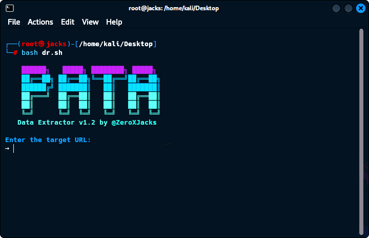

## Data Extractor v1.2 by @ZeroXJacks



## Overview
Data Extractor v1.2 is a Bash script for extracting sensitive data from websites, including:
- API endpoints
- Emails
- API keys, tokens, and passwords
- JavaScript file links
- Archived API endpoints via Wayback Machine

## Requirements
- Bash-supported OS (Linux/macOS/WSL)
- `curl` command-line tool
- Internet connection

## Usage
1. Run the script:
   ```bash
   chmod +x pata.sh
   ./pata.sh
   ```
2. Enter the target URL.
3. Extracted data is saved in `extracted_data.txt`.
4. The script displays the number of extracted items.

## Features
- Scans website content for sensitive data
- Extracts JavaScript files for hidden information
- Searches archive.org for historical endpoints

## Output
- All extracted data is saved in `extracted_data.txt`.
- Displays total extracted items at the end.

## Notes
- Use this tool only for ethical and legal purposes.
- The author is not responsible for any misuse.

## Developer
**@ZeroXJacks**

